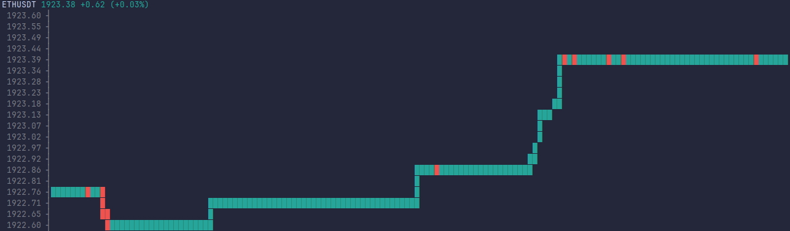

<h1>go-crypto-tracker</h1>

<p>Terminal app that streams live price data from Binance and renders it as
an ASCII chart.</p>

## Screenshot



## What it does

Connects to the Binance websocket kline stream for a configured symbol and interval, backfills recent history over REST on startup, keeps a rolling window of closing prices in memory, and redraws an ASCII line chart in the terminal twice a second. Reconnects automatically on dropped connections.

## Requirements

Go 1.25+

## Configuration

Includes a custom `.env` parser and validator (no third-party dependency) that loads and validates configuration on startup.

Set values in `.env` (or as environment variables, which take precedence):

```
SYMBOL="ETHUSDT"
INTERVAL="1m"
BACKFILL="100"
```

- `SYMBOL` - trading pair, e.g. `ETHUSDT`
- `INTERVAL` - kline interval, one of `1m 3m 5m 15m 30m 1h 2h 4h 6h 8h 12h 1d 3d 1w 1M`
- `BACKFILL` - number of historical candles to fetch on startup, `0`-`1000`

## Usage

```
make tracker
```

Or directly:

```
go run ./cmd/tracker
```

Press Ctrl+C to stop.

## Testing

```
make test
```

Coverage report:

```
make cover
```

## Layout

```
cmd/tracker      entry point
cmd/config       .env loading and validation
internal         ASCII chart rendering
internal/binance REST backfill and websocket client
internal/market  kline model and ring buffer store
internal/tracker orchestrates the transport and serves snapshots
```
